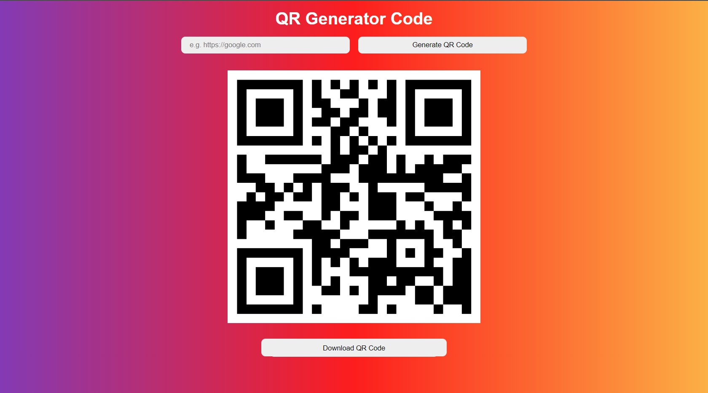

# QR Code Generator using ReactJS + Vite + Firebase

<a href='https://qr-code-generator-57fce.web.app/'>
 
</p>
</a>

## Link

[https://qr-code-generator-57fce.web.app/](https://qr-code-generator-57fce.web.app/)

After entering URL and pressing the generate `QR Code button`, the app will generate unique QR Code.

There is also option to download it and share it. 

## Requirements

Before using this project, you will need to have installed [Node.js](https://nodejs.org/en/), `npm` and [git](https://git-scm.com/).

## Usage

```
$ git clone https://github.com/michal9108/qr-code-generator.git
$ cd qr-code-generator.git
$ npm create vite@latest .
$ npm install or yarn install
$ npm i qrcode or yarn add qrcode
```

The application will be listening on port 3000. Open [http://localhost:3000](http://localhost:3000) to view it in your browser.


## Build Setup

```
# install dependencies
$ npm install or yarn install

# serve with hot reload at localhost:3000
$ npm start or yarn run start

# build for production and launch/deploy on Firebase server
$ firebase login
$ yarn run build
$ firebase init

Choose `build` as a public dir

$ firebase deploy
```

For detailed explanation on how things work, check out the [react.js](https://reactjs.org/), [Vite](https://v2.vitejs.dev/) and [Firebase](https://firebase.google.com/docs?authuser=0&hl=en) documentation.


